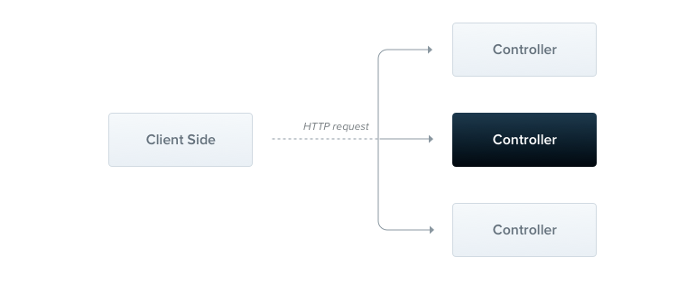
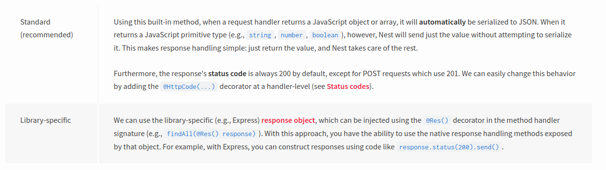
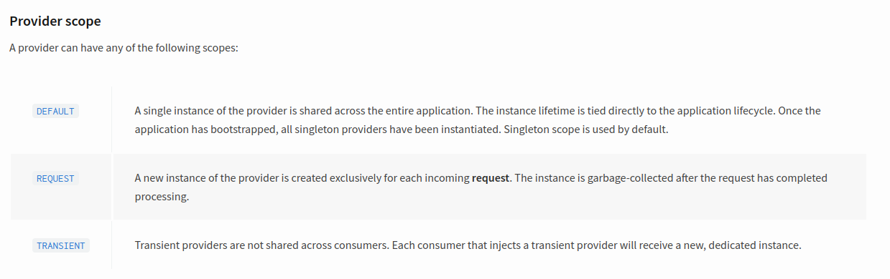
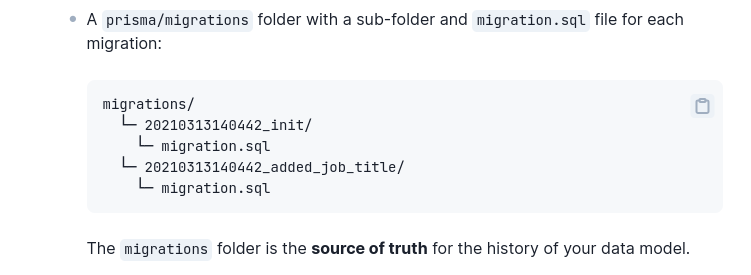
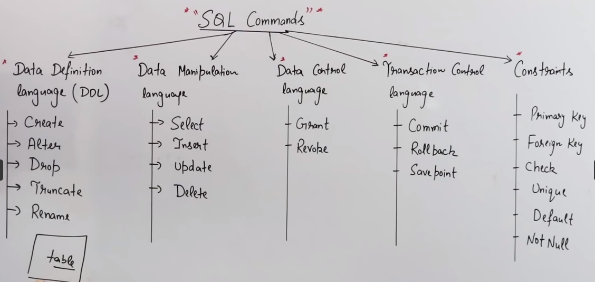

# Validation at route handler level:

It is best practice to validate the correctness of any data sent into a web application. To automatically validate incoming requests, Nest provides several pipes available right out-of-the-box:

- ValidationPipe
- ParseIntPipe
- ParseBoolPipe
- ParseArrayPipe
- ParseUUIDPipe

## Using the built-in ValidationPipe

Nest also handles validations by using the built-in validationPipe

### To use this, follow the below steps:

install the required dependency by using below command

```bash
$ npm i --save class-validator class-transformer
```

```bash
HINT
ValidationPipe is exported from the @nestjs/common package.
```

ValidationPipe uses the class-validator and class-transformer libraries.

## Auto-validation:

We'll start by binding ValidationPipe at the application level, thus ensuring all endpoints are protected from receiving incorrect data.

```bash
## Place below code in application level main.ts (Best Practise)
##   After await NestFactory.create(AppModule);
app.useGlobalPipes(new ValidationPipe());
## You can also use validations at any RouteHanler level
i.e:
  @Get('getonly/:id')
  findOne(@Param('id',new ParseIntPipe()) id: number) {
    return this.receipt3Service.findOne(+id);
  }
```

## Next Step is to test our Pipe:

Now we can add a few validation rules in our DTO (Data Transfer Object)

```bash
## To test our pipe, let's create a basic endpoint.
@Post()
create(@Body() createUserDto: CreateUserDto) {
  return 'This action adds a new user';
}
```

We do this by using decorators provided by the class-validator package, described in detail [here](https://github.com/typestack/class-validator#validation-decorators).

```bash
i.e:
 import { IsEmail, IsNotEmpty } from 'class-validator';

export class CreateUserDto {
  @IsEmail()
  email: string;

  @IsNotEmpty()
  password: string;
}
```

```bash
## HINT
any route that uses the CreateUserDto will automatically enforce these validation rules.
```

With these rules in place, if a request hits our endpoint with an invalid email property in the request body, the application will automatically respond with a 400 Bad Request code, along with the following response body:

```bash
{
  "statusCode": 400,
  "error": "Bad Request",
  "message": ["email must be an email"]
}
```

```
IMPORTANT

by using whitelist property as true in ValidationPipe the pipe will ignore (not acepted) the whitelist data even if it is present in request/payload body or not.

whitelist property is the property of a Dto which is not protected by any class-validator.
```

## @Param() , @Query(), @Body() Annotations:

These annotations are used to extract data from incommping http requests in order to proceed and handle them appropriately:

## @Param:

This annotation is used to extract data from route parameter in the url of an incomming http request.

#### Example:

```
@Get('users/:id')             :id is a route parameter here.
getUserById(@Param('id') id: string): string {
  return `Fetching user with ID: ${id}`;
}

i.e:
URL Like >>>   /users/5    (5 is extracted here)
```

## @Query:

This annotation is used to extract data from route place holder in the form of key,value pair.

#### Example:

```
@Get('users')
getUsersByRole(@Query('role') role: string): string {
  return `Fetching users with role: ${role}`;
}

i.e:
URL Like >>>   /users?role='Admin'
```

## @Body:

This annotation is used to extract data from Json payload.

#### Example:

```
  @Post('users')
  create(
    @Body() createUserDto: CreateUserDto,
  ) {
    return this.userService.create(createUserDto);
  }

i.e:
URL Like >>>   /users     with a payload of
{
    "name":"username",
    "age":23
}
```

# Controllers:

Controllers are responsible for handling incoming requests and returning responses to the client.

<p align="center">
 </a>
</p>

<!--  -->

## Routing:

In the following example we'll use the @Controller() decorator, which is required to define a basic controller. We'll specify an optional route path prefix of cats. Using a path prefix in a @Controller() decorator allows us to easily group a set of related routes, and minimize repetitive code.

```
import { Controller, Get } from '@nestjs/common';

@Controller('cats')  // optional controller path prefix  i.e ('cats')
export class CatsController {
  @Get()
  findAll(): string {
    return 'This action returns all cats';
  }
}
```

```bash
HINT
## To create a controller using the CLI, simply execute
$ nest g controller [name] command.
## You can also specify any path in the methods decorator like:
@Get('breed')
## Now, The route path for a handler is determined by concatenating the (optional) prefix declared for the controller, and any path specified in the method's decorator.
LIKE GET /cats/breed
```

## Nest employs two different options for manipulating responses:

<p align="center">
 </a>
</p>

## Request object:

Handlers often need access to the client request details. Nest provides access to the request object of the underlying platform (Express by default). We can access the request object by instructing Nest to inject it by adding the @Req() decorator to the handler's signature.

```
import { Controller, Get, Req } from '@nestjs/common';
import { Request } from 'express';

@Controller('cats')
export class CatsController {
  @Get()
  findAll(@Req() request: Request): string {
    return 'This action returns all cats';
  }
}
```

## Route wildcards:

Pattern based routes are supported as well. For instance, the asterisk is used as a wildcard, and will match any combination of characters.

```bash
@Get('ab*cd')
findAll() {
  return 'This route uses a wildcard';
}
##  a raoute path may be any matching pattern
##  i.e     ab*()shdcd
```

## Status code:

As mentioned, the response status code is always 200 by default, except for POST requests which are 201. We can easily change this behavior by adding the @HttpCode(...) decorator at a handler level.

```
@Post()
@HttpCode(204)
create() {
  return 'This action adds a new cat';
}
```

## Redirection:

```
@Get()
@Redirect('https://nestjs.com', 301)
```

# Providers:

Providers are a fundamental concept in Nest. Many of the basic Nest classes may be treated as a provider – services, repositories, factories, helpers, and so on. The main idea of a provider is that it can be injected as a dependency

```
The @Injectable() decorator is used to create a provider class.
```

```
import { Injectable } from '@nestjs/common';
import { Cat } from './interfaces/cat.interface';

@Injectable()
export class CatsService {
  private readonly cats: Cat[] = [];

  findAll(): Cat[] {
    return this.cats;
  }
}
```

## Provider Scope:

<p align="center">
 </a>
</p>

```
HINT
Singleton scope is used by default.
```

# Prisma Migrations:

Prisma uses migration histories to track changes to your schema.

<p align="center">
 </a>
</p>

## Prisma Migrate Commands

```
prisma migrate dev
prisma migrate dev --create-only --name anyname
prisma migrate deploy
prisma migrate resolve
prisma migrate reset
```

## Sql Commands:

<p align="center">
 </a>
</p>

# Configuration:

Applications often run in different environments. Depending on the environment, different configuration settings should be used.

## Installation:

```bash
## To begin using it, we first install the required dependency.
$ npm i --save @nestjs/config
```

```
HINT
The @nestjs/config package internally uses dotenv.
```

In app level module We can import ConfigModule like below:

```
import { Module } from '@nestjs/common';
import { ConfigModule } from '@nestjs/config';

@Module({
  imports: [ConfigModule.forRoot()],
})
export class AppModule {}
```

```bash
HINT
The above code will load and parse .env file from root directory and assigned it to process.env, and store the result in a private structure that you can access through the ConfigService. The forRoot() method registers the ConfigService provider, which provides a get() method for reading these parsed/merged configuration variables.
```

## Custom env file path:

```bash
ConfigModule.forRoot({
  envFilePath: '.env.conf',
});

## For multiple environment files
ConfigModule.forRoot({
  envFilePath: ['.env.development.local', '.env.development'],
});
```

## Disable env variables loading:

```
ConfigModule.forRoot({
  ignoreEnvFile: true,
});
```

## Use Module Globally:

```
ConfigModule.forRoot({
  isGlobal: true,
});
```

## Using the ConfigService:

```bash
## First import the module in which we want to access

@Module({
  imports: [ConfigModule],
  // ...
})
## After that get it  using standard constructor injection:
constructor(private configService: ConfigService) {}
```

Now get variable by using

```
// get an environment variable
const dbUser = this.configService.get<string>('DATABASE_USER');
```

The get() method also takes an optional second argument defining a default value, which will be returned when the key doesn't exist, as shown below:

```
// use "localhost" when "database.host" is not defined
const dbHost = this.configService.get<string>('database.host', 'localhost');
```

## Partial Registration:

Thus far, we've processed configuration files in our root module (e.g., AppModule), with the forRoot() method. Perhaps you have a more complex project structure, with feature-specific configuration files located in multiple different directories. Rather than load all these files in the root module, the @nestjs/config package provides a feature called partial registration,

```
import databaseConfig from './config/database.config';

@Module({
  imports: [ConfigModule.forFeature(databaseConfig)],
})
export class DatabaseModule {}
```

## Using the main.ts:

While our config is a stored in a service, it can still be used in the main.ts

To access it, you must use the app.get() method, followed by the service reference:

```
const configService = app.get(ConfigService);
```

```bash
## You can then use it as usual, by calling the get method with the configuration key:
const port = configService.get('PORT');
```
